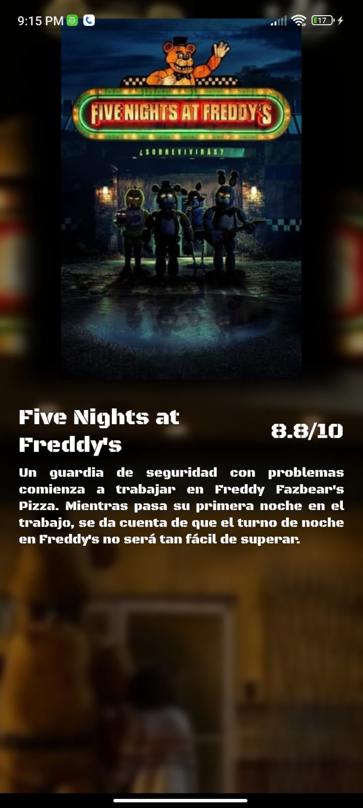
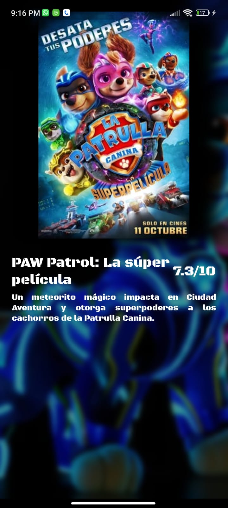
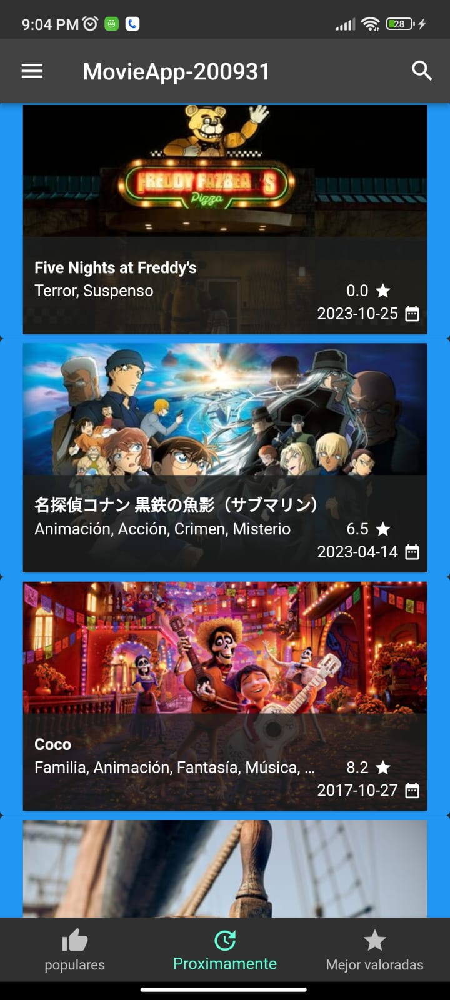
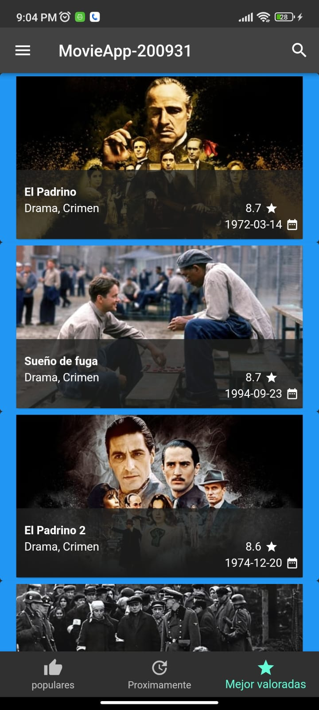
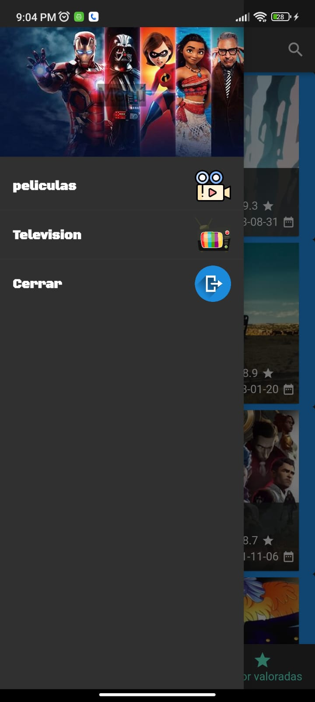
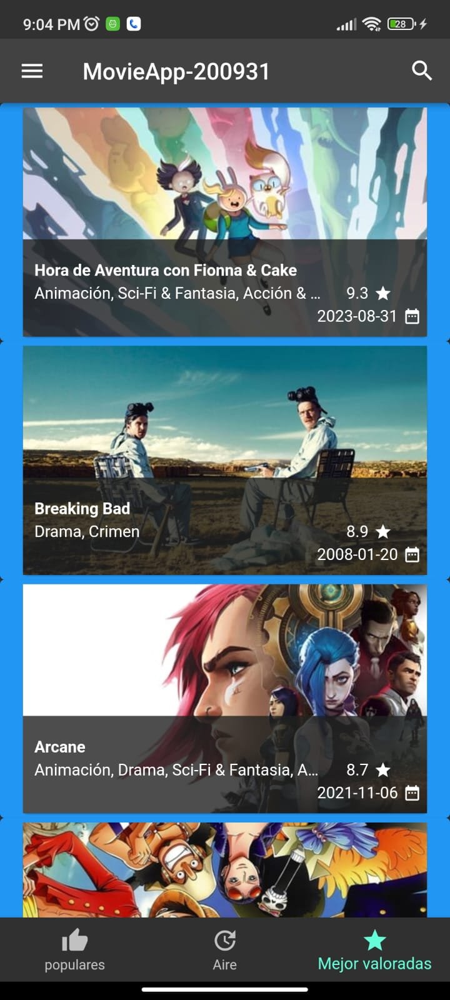

# MovieApp-200527

## Información General

- **Creado por:** Crystian Enrique Suarez Cuevas
- **Asignatura:** Desarrollo Movil Integral
- **Grado:** 10
- **Grupo:** A
- **Docente:** MTI. Marco Antonio Ramirez Hernandez

## Descripción del Proyecto

Este proyecto representa una aplicación de muestra desarrollada en Flutter que muestra una página de inicio de la aplicación "MovieApp-200527". La página de inicio contiene los siguientes componentes principales:

### `Home.dart`

Este archivo contiene la clase `Home`, que representa la página de inicio de la aplicación. En el método `initState`, se llama a `_loadJson` para cargar datos de películas utilizando `HttpHandler`. También se define un estilo de fuente personalizado y se crea la estructura principal de la aplicación, que incluye una AppBar, un Drawer y un BottomNavigationBar.

## Capturas de Pantalla

  
  
  
  
  
  
  

## Instalación

Para ejecutar esta aplicación en tu entorno de desarrollo, sigue estos pasos:

1. Asegúrate de tener Flutter y Dart instalados en tu sistema.

2. Clona este repositorio o descarga el código fuente.

3. Abre una terminal en la carpeta del proyecto.

4. Ejecuta `flutter pub get` para obtener las dependencias.

5. Ejecuta `flutter run` para iniciar la aplicación en un emulador o dispositivo físico.

Este proyecto es un ejemplo sólido de una página de inicio en Flutter que utiliza elementos de interfaz de usuario personalizados y estilos de fuente únicos. Si tienes alguna pregunta o necesitas ayuda adicional, no dudes en contactar al autor.
